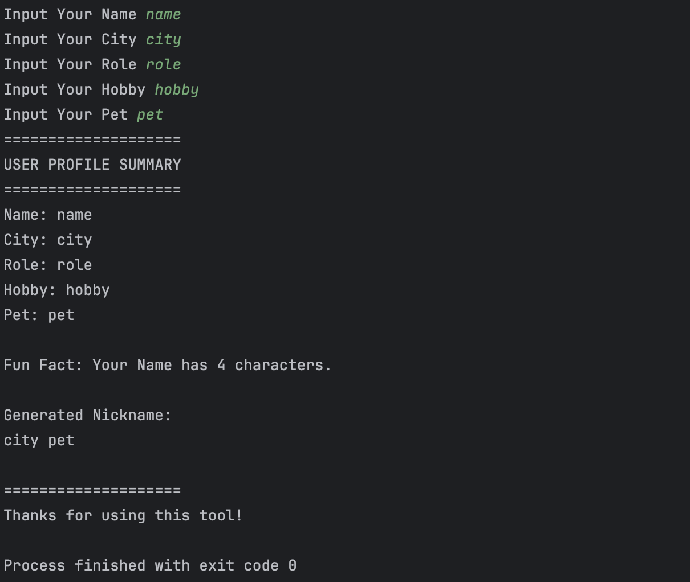

# User Profile Generator


<p align="center"><strong>A tiny Python CLI that transforms simple inputs into a clean user profile summary.</strong></p>

---

## 📘 About The Project

The **User Profile Generator** is a lightweight Python CLI app designed to help beginners practice working with:

- Input handling  
- String formatting  
- Variables  
- Basic logic in Python  

This project exists to turn simple learning exercises into something usable and portfolio-ready — instead of random practice code that never sees the light of day.

### 🖼 Screenshot


---

## 🛠 Tech Stack

| Technology | Description |
|-----------|-------------|
| 🐍 **Python** | Core language used to build the CLI |
| 💻 **Terminal/CLI** | Interactive user interface |
| 📄 **Markdown** | Documentation format |

---

## ✨ Key Features

- 🧑‍💻 **Interactive CLI Form** — Collects name, city, role, hobby, and pet.
- 🔢 **Auto Character Count** — Displays how many characters your name has.
- 🏷 **Generated Nickname** — Combines your city + pet into a fun alias.
- 📊 **Clean Summary Output** — Easy-to-read profile section with ASCII barriers.
- 🚀 **Beginner-Friendly Codebase** — Perfect stepping stone for learning Python basics.

---

## 🚀 Getting Started

### ✅ Prerequisites

Make sure you have:

- **Python 3.8+** installed  
- A working **terminal** (macOS, Linux, Windows PowerShell)

### 📦 Installation

Clone the repository:

```bash
git clone https://github.com/yourusername/user-profile-generator.git
cd user-profile-generator
```

### ▶️ Usage

Run the script:

```bash
python main.py
```

Example interaction:

```
Input Your Name: Name
Input Your City: City
Input Your Role: Role
Input Your Hobby: Hobby
Input Your Pet: Pet
```

---

## 🤝 Contributing

Contributions make the open-source world amazing.  
Feel free to **fork**, **open issues**, and submit **pull requests**.

Any improvements — from bug fixes to new features — are welcome!

---

## 📄 License & Contact

Distributed under the **MIT License**.

**Author Contact:**  
🌐 https://alhikam.me
🐙 https://github.com/yourusername